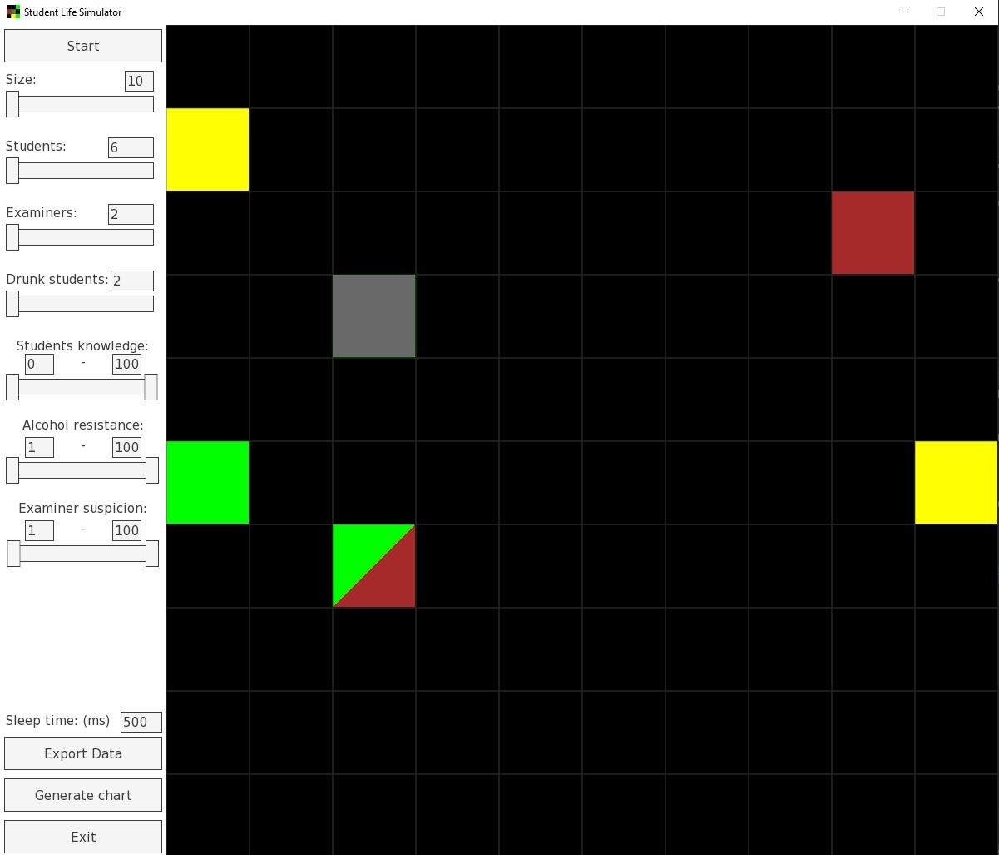

# Student Life Simulator

## Table of Contents
* [Project Description](#project-description)
* [Technologies](#technologies)
* [GUI overview](#gui-overview)
* [Sample runs](#sample-runs)
* [Authors](#authors)

---
## Project Description
This is agent-based simulation realized as OOP classes credit.

It assumes a board on which two types of agents are randomly placed at the beginning of a simulation. These are **Students** and **Examiners**.  
Simulation begins with a certain number of drunk students. When they meet with one of their fellows they offer to drink a beer together.  
Whenever students meet with an examiner they are examined. Sober students easily pass every exam but those who had a beer aren't always that lucky. The possibility of passing an exam is a combination of examiner's suspicion and a number of beers drunk. Examiners hate sleeping students and fail them immediately.  
Students have to pass 7 semesters, each consists of 4 exams. Student is fired after failing 4 exams.  
Simulation finishes when there are no more active students.  

---
## Technologies
Project was created using **Visual Studio**.
* **C++11**
* **GoogleTest**
* **SFML**
* **TGUI**
* **Sciplot**
---

## GUI overview

* **Buttons:**
	- **Start** - clears window, generates a new random simulation and runs it
    - **Stop** (appears after Start is clicked) - stops the simulation at the current point
    - **Export data** - exports simulation statistics by epoch in csv format
    - **Generate chart** - generates chart containing statistics by epoch and saves it as pdf
    - **Exit**

* **Variable parameters:**
    - **Size** - number of squares per board side
    - **Students** - number of students on board (including drunk students)
    - **Examiners** - number of examiners
    - **Drunk students** - number of drunk students at the beginning (1 beer)
    - **Sleep time** - interval between each epoch in ms

* **Variable range parameters:**
    (corresponds to the range of which a random number will be chosen from)
    - **Students knowledge** - the unlikeliness of having a beer with a drunk student
    - **Alcohol resistance** - the threshold of beers count at which students goes to sleep
    - **Examiner suspicion** - the likeliness of examiner recognizing a drunk student

* **Color of square:**
    - **Red** - examiner
    - **Green** - sober student
    - **Yellow** - drunk student
    - **Grey** - sleeping student

	When multiple students are present in one square its color is prioritized by the most drunk one (i.e. sleeping takes over drunk, drunk takes over sober).  
	When examiner and student are both present in a square it is displayed as two triangles.

---
## Sample runs
[This section is considerably long thus was moved to the separate file.](docs/sample-runs.md)

---
## Authors
Created by:
* Andrzej Perczak (xNombre)
* Szymon Trembecki (SimiVoid)