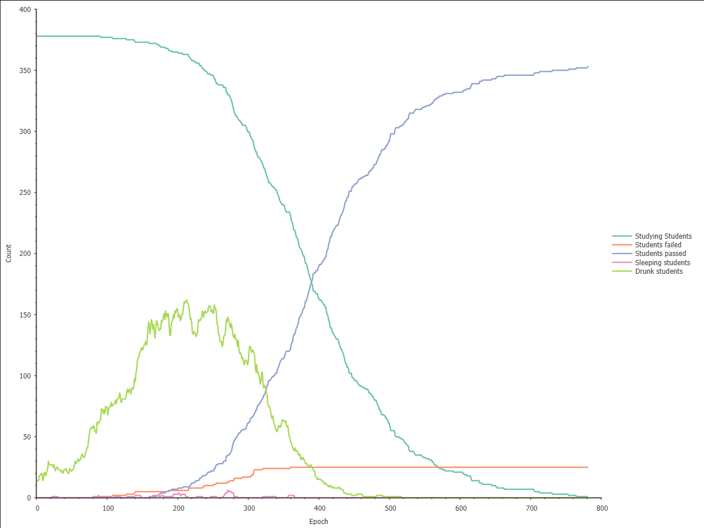

# Sample runs

### Example 1
* **Size:** 20
* **Students:** 378
* **Examiners:** 30
* **Drunk students:** 14
* **Students Knowledge:** 86-100
* **Alcohol resistance:** 5-7
* **Examiner suspicion:** 0-100

> This is an example of balanced simulation, with a few students drunk; and not much eager to drink, too
---
### Example 2
*parameters derived from Example 1*
* **Examiner suspicion:** 0-50

> Now let's reduce maximum examiner suspicion range to 50, we can notice much more students passing the studies.

---
### Example 3
* **Size:** 50
* **Students:** 966
* **Examiners:** 266
* **Drunk students:** 955
* **Students Knowledge:** 20-50
* **Alcohol resistance:** 5-25
* **Examiner suspicion:** 0-100

> This example is realized on much larger scale. Students eagerly drink, almost whole population is drunk.

---
### Example 4
*parameters derived from Example 3*
* **Alcohol resistance:** 5

> This example demonstrates alcohol resistance influence. Students quickly go to sleep and get sober much faster. This is reflected by a bit less failed students.

---
### Example 5
*parameters derived from Example 3*
* **Students Knowledge:** 75-95

> This example shows a case where students aren't eager to drink. Almost every student passes because drunk count tends toward 0.

[Go back](../README.md)